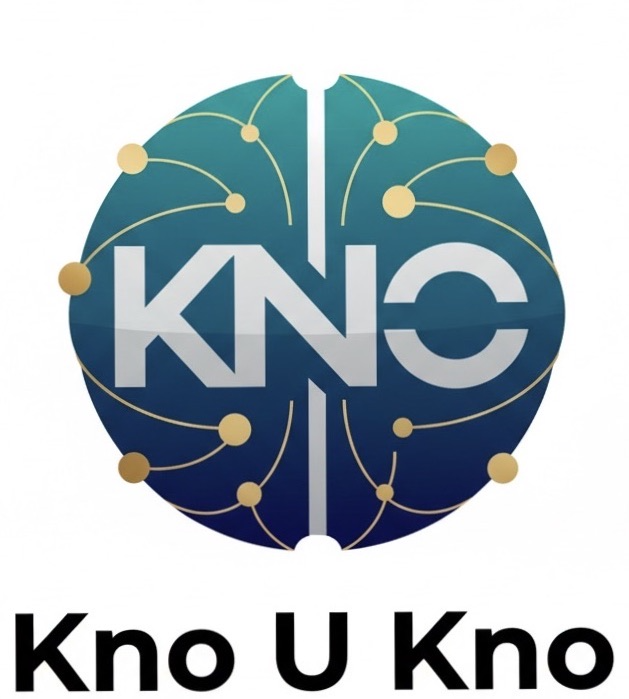

# KnoUKno.net

Full stack implementation with:

- Next.js frontend (pages router + CSS3 + Bootstrap 5)
- Express backend API
- MongoDB + Mongoose collections
- JWT auth with bcryptjs
- Rate limiting, helmet, cors, dotenv
- PayPal link workflow placeholders
- Dockerized frontend/backend/mongo

## Implemented collections

- payment
- title
- login
- register
- print
- save
- question
- grade
- rated
- answers
- average
- delete
- Email

All collections are available in admin via `/api/admin/collection/:name`.

## Local setup

1. Install dependencies:
   - `npm install`
   - `npm --prefix backend install`
   - `npm --prefix frontend install`
2. Copy examples:
   - `cp backend/.env.example backend/.env`
   - `cp frontend/.env.local.example frontend/.env.local`
3. Run:
   - `npm run dev` (auto-starts Mongo container and then runs backend + frontend)

Frontend: `http://localhost:3000`
Backend: `http://localhost:4000`

## Docker

- Build and run all services:
  - `docker compose up --build`

## Tier limits

- Free: 5 questions
- Member: 50 questions / month flow
- Pro: 75 questions / year flow
- Bonus packs: 100, 150, 175 supported through payment confirmation endpoint
